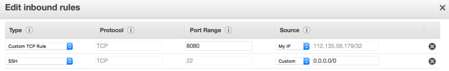

# AWS (Amazon Web Services)
## Deploying a Spring Boot Application on Aws using 'EC2' and 'RDS'
### (1) RDS Setup
    * Login to the Amazon dashboard.
    * Go to the RDS Dashboard.
    * Click on the 'Lunch a DB Instance'.
    * According to the Amazon, We can create Amazon Aurora, MySQL, MariaDB, PostgreSQL, ORACLE or SQL Server. We select the MySQL as a database.
    * Then we’ve to select the database plan. We selected ‘Dev/Test‘ as a plan. Click the ‘Next Step‘.
    * In this phase, you need to provide database specific details such as db instance name, username and password. Then click on the ‘Next Step‘
        * Instance Specifications
        * DB Instance Class => (db.t2.micro --1 vCPU, 1 GiB RAM)
        * DB Instance Identifier => (ballisticdb)
        * Master Username => (ballistic)
        * Master Password => (ballistic) <--> Confirm Password => (ballistic)
        * Configure Advanced Settings
        * VPC Security Group(s) ==> Create if not other wise used exist "Created VPC"
        * Database Name => (barco_db)
    * Connect via MySQL client
        I’m using the -->(MySql-Workbench)<-- as a client. You can use any client to connect to the Amazon RDS instance.
          * First of all, we need to change the security groups to allow connect from outside.
          * Right click on the RDS instance. Click on the ‘See Details‘. Then Click on the ‘Security Group‘.
          * Edit ‘Inbound Rules‘ and set ‘Source‘ support to Anywhere.
###  (2) Configure the Spring Boot Application(RDS)
    Now, we’re going to change the database connection properties in the application and build a jar file.
    * Open the application.properties the file is located under the ‘resource‘ directory.
    *Change the properties as following.
       * spring.datasource.url=jdbc:mysql://ballistic_db.***********.us-west-2.rds.amazonaws.com:3306/barco_db
       * spring.datasource.username=ballistic
       * spring.datasource.password=ballistic
       * spring.datasource.driver-class-name=com.mysql.cj.jdbc.Driver
       * spring.jpa.database-platform=org.hibernate.dialect.MySQL5Dialect
       * spring.jpa.hibernate.ddl-auto=update
    * The next step is, build a jar file. Use the -->(mvn clean install)<-- to build it.
### (3) Create an EC2 instance and deploy it
    * Go to the AWS console. Select the ‘EC2 Service‘.
    * Then, select ‘instances‘ and click on the ‘Launch Instance‘ button. There are no of OS, we can select as a server (Ubuntu, RedHat, Amazon Linux, SUSE Linux). For this tutorial, we selected the Amazon Linux 2 LTS Candidate AMI 2017.12.0 (HVM), SSD Volume Type .
    * Select the free tier eligible instance and launch it.
    * During the launch, it will ask for a creating security key. Select the ‘Create a new key pair‘ and give a name as a ‘ballistic‘. Finally, download the key.
    * Rename the key as ‘ballistic.pem‘ (remove the .txt).
    * If you are using Mac OS or Linux give a permission to the file using a following command.
    * chmod 400 mydevgeek.pem
    Note: – If you want to see more details how to connect to the ec2 through ssh, select the instance and click on the ‘Connect‘ button.
    * Now, we ready to connect to the ec2 instance via terminal (command line). Use the ssh command that shows in the ‘Connect To Your Instance‘ when you click on the ‘Connect‘ button as mentioned in above.
    * ssh -i "ballistic.pem" ec2-user@ec2-**********.us-west-2.compute.amazonaws.com
    * First thing, update the Ubuntu.
       * sudo apt-get update
       * Check available java versions.
       * java -versions
       * Install java 8.
       * sudo apt install default-jre
       * Next thing is, upload the jar file into the ec2. So that, I’m using a CyberDuck (Filezilla also another option)
    Note: – provide the Public DNS, Username and SSH key.
    * Create a new directory inside ‘home/ubuntu‘. The directory name is ‘spring-app‘.
    * Upload the jar file that contains under the ‘target‘ directory into the ‘home/ubuntu/single-app‘ using CyberDuck.
    * While uploading, open 8080 port for outside the world. Select the ‘Security Group‘ of the instance. Add following rule.

    
    * Finally, following command can be used to run the REST service.
    * nohup java -jar spring-boot-1.0-SNAPSHOT.jar &
    * nohup – use for terminal output goes into the nohup.out file.
    * & – use for running as a background service. So that terminal is free to do another work.
    How to Test it. We can check whether the application is running or not look at the nohup.out file. Use the following command to check the nohup.out.
    less nohup.out
    When you click on the EC2 instance, you will be able to find the ‘IPv4 Public IP‘ that IP can be used to send a REST request.
### (4) Download Tool for Access these think
    1) For Mysql Connection Checking used --> (Mysql-Workbanch)
    2) For Transfer file used --> (WinSCP)
    3) For Testing Checking log durring dev --> (Xshell 5)
    4) For MobaXterm for check the all Process....
    5) PostMan for Api test
### (5) Few Cmd for Server
     -------------------------------------------------------------------
         # chmod 400 nabeel.pem  ---> server access comand
         # ssh -I D:\nabeel_pem\nabeel.pem -p 6616 nabeel@172.30.9.93
         # alias
         # cl ---> tomcat check
         # tl ---> traffic logs
         # ad | grep -i monitor  ----> check mongo
         # ad | grep -i error  ----> whole error
         # ad | grep -I exception  ---> mongo exception
         # logs  --> li ---> # catalina.out.current date  ----> check
     -------------------------------------------------------------------
    
## Deploying a Spring Boot Application on Aws using 'EC2' and 'RDS' and 'S3'
